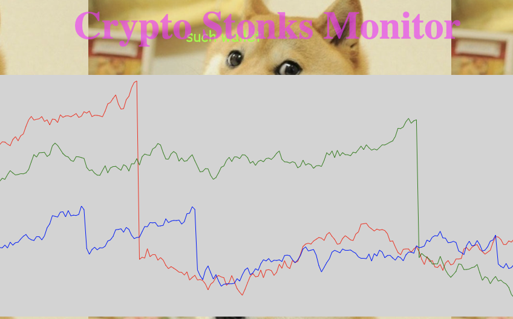

# streamy-mcstreamface
Tired of JavaScript charting libraries? Want to just draw some god damn lines to visualize your streaming data, with auto-zoom and auto-scroll, but without anything fance and usless, like axes labels? You've come to the right place. Introducing Streamy McStreamface.

# Demo

Please try this [very sophisticated demo](https://marioslab.io/dump/streamy/) to convince yourself that Streamy McStreamface is what you've always been looking for.

Please also look at the prestine [source code](https://github.com/badlogic/streamy-mcstreamface/blob/main/LICENSE) of this demo.

# Usage
First you need to get my fine code into your project. You have two choices. Option 1:
```
<script src="https://cdn.jsdelivr.net/npm/@marioslab/streamy-mcstreamface@1.0.0/dist/iife/streamy-mcstreamface.min.js">
```

That's for very cool old people like me. Every function and "class" is exposed on the global `streamy` object.

If you are young and don't know any better, you may want to manage your project dependencies with NPM and use a bundler with a barrel to energize minified bundles you can then throw at your kubernetes cluster or something:

```
npm install @marioslab/streamy-mcstreamface
```

And in your JavaScript or TypeScript sources, import the thing:

```
import * as streamy from "@marioslab/streamy-macstreamface"
```

Great, you can finally write some damned JavaScript code. Let's start with HTML tho. You'll need a canvas to render those beautiful lines to:

```
<canvas id="foo"></canvas>
```

Streamy McStreamface doesn't care what CSS abomination you attach to that innocent canvas. You do you.

It's time to write code. Let's start by creating the chart and some objects holding the data.

```
let canvas = document.querySelector("canvas");
let chart = new streamy.Chart(canvas, { padding: 10, numSamples: 400 });
```

You told the new chart about the padding measured in pixels, and how many samples should maximally be shown in the chart. Let's add some data.

```
let line = chart.addLine("my data", "green");
for (var i = 0; i < 200; i++) line.add(Math.random() * 100);
```

We've added a line to the chart called `"my data"` that will be drawn with the (CSS) color `green`. We've also added 200 random values to the line, just for fun.

You won't see anything on screen tho. For that, you have to tell the chart to render itself onto the canvas.

```
chart.render();
```

The chart will scale the last `numSamples` data points in the line to fit inside the canvas, minus the `padding`. That also works if you've added multiple lines to the chart.

And that's it. Keep adding data to your line(s) via `line.add(value)`, then call `chart.render()`. When and how you do that is totally up to you.

# Will you add feature $X
No.


# Development
Install Git, Node.js, and Visual Studio Code. Then:

```
git clone https://github.com/badlogic/streamy-mcstreamface
cd streamy-mcstreamface
npm run dev
code.
```

Press `F5`, modify code, press `CTRL+S`, see the page auto-update with your changes, set some breakpoints. Just do your programmer thing.